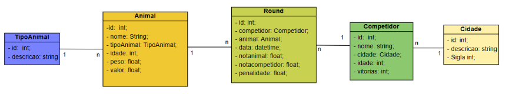

# Projeto RodeoArena

## Requisitos Funcionais

- RF01 - Ter o CRUD para todas as tabelas
- RF01 - Ser possivel simular um round.

## Requisitos Não Funcionais

- RNF01 - Camada de modelos
- RNF02 - Migrations
- RNF03 - Segurança com o admin

### Regras de negocio
Apenas admin tem acesso ao crud.

